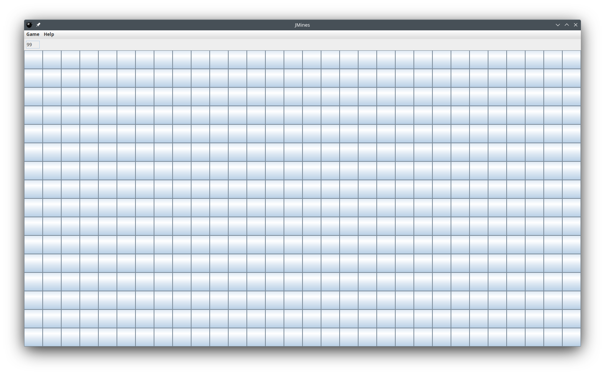
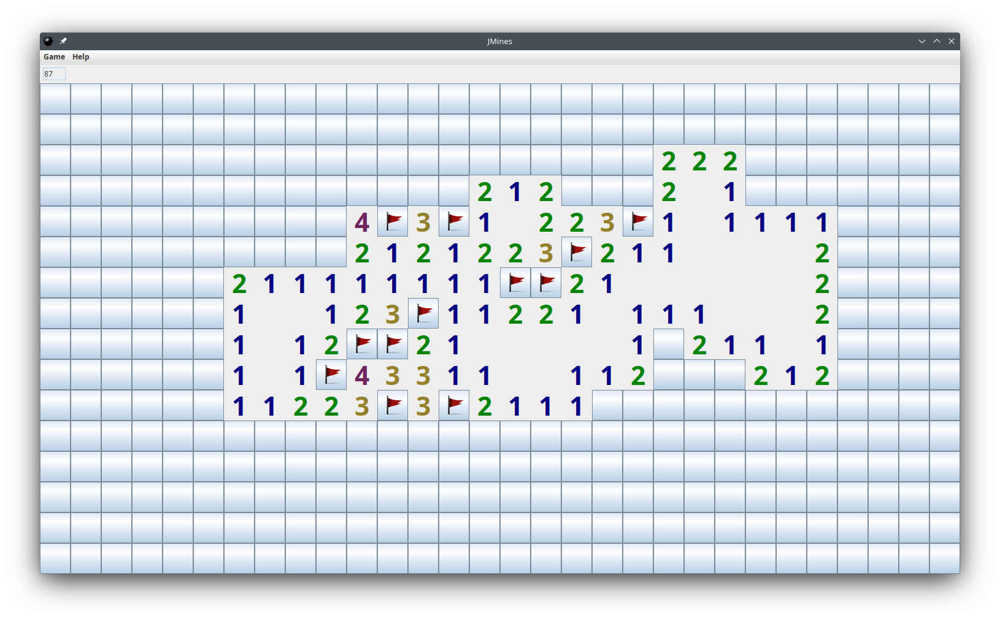
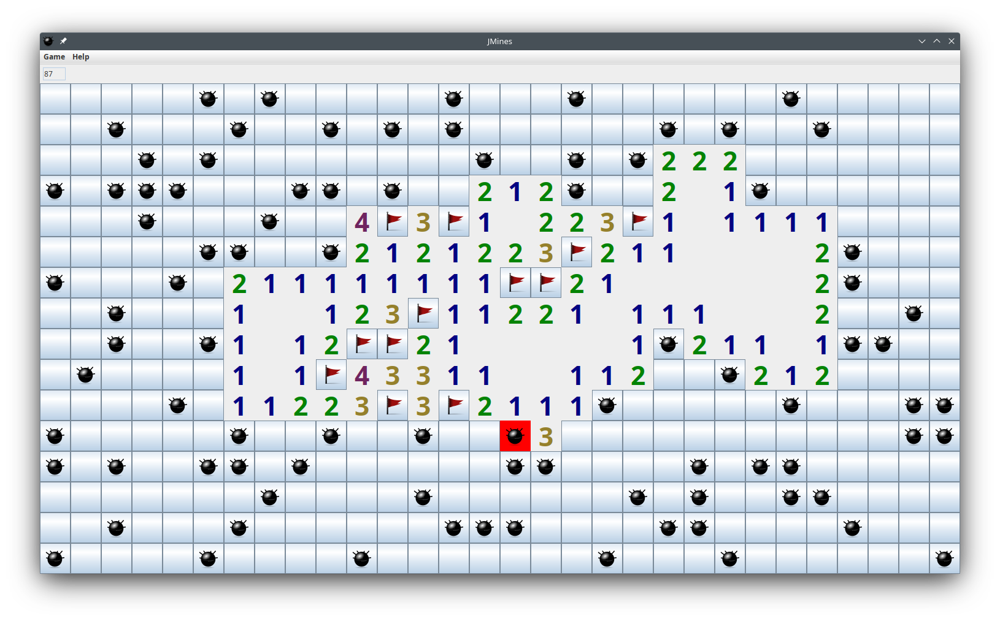

# About this project
This is a simple implementation of the Minesweeper game. It is possible to play the game and it also features an auto solver.
Keep in mind, sometimes it is not possible to logically decide the next step, in those cases the auto solver will take a random guess - so it sometimes fail!





# Building
To build the project run the command:
```shell
./gradlew jar
```

The executable JAR file will be on **build/libs/JMines-1.0.jar**. To run it, make sure the assets folder is in the current working directory.

# Assets
Assets where taken from [KMines](https://apps.kde.org/kmines)
